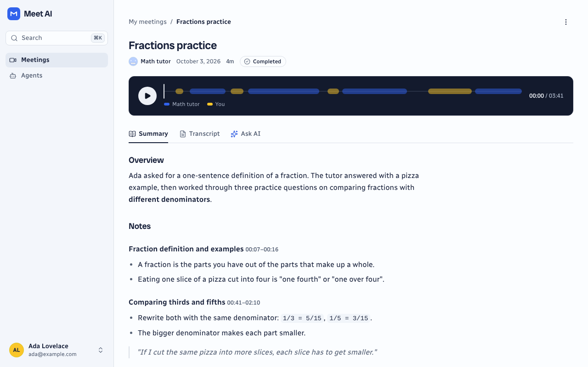
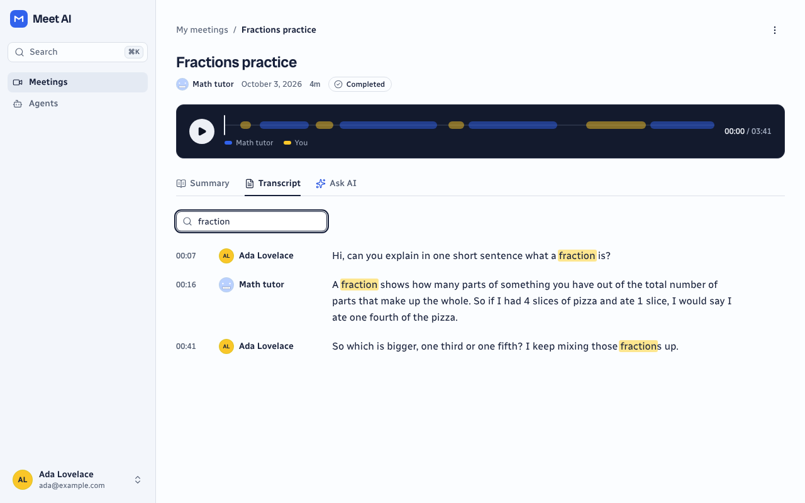
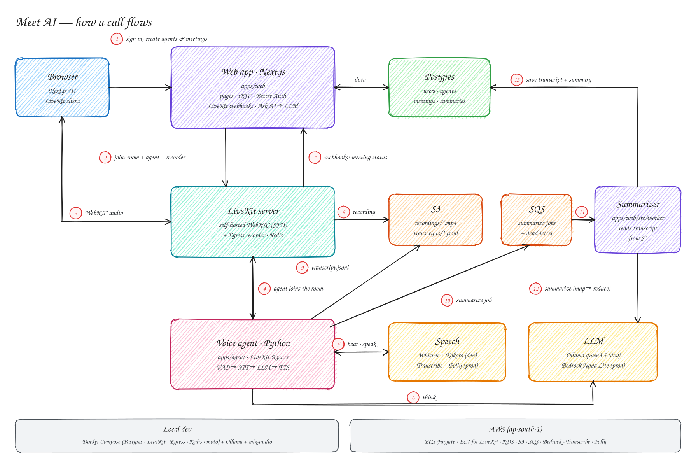

# Meet AI

**Voice calls with AI agents you design.** Create an agent with its own instructions, start a meeting, and talk to it in your browser. When you hang up you get a transcript, an audio recording, a summary, and a chat that answers questions about the call.

The whole stack runs on your laptop — including the speech models and the LLM — and ships with the infrastructure code to deploy it to AWS.

[](https://github.com/MaheshMoholkar/meet-ai/actions/workflows/ci.yml)


| After a call: summary | Searchable transcript |
|---|---|
|  |  |

> 📖 New to some of this? **[The beginner's guide](docs/blog.md)** walks through every concept the project uses — WebRTC, voice agents, queues, Docker, AWS — in short sections tied to the code.

## Features

- **Agents** with a name and instructions ("You are a patient math tutor…").
- **Voice meetings** in the browser. The agent joins the call, listens, thinks and talks back.
- **After the call**: a timestamped transcript with search, an audio recording, a markdown summary, and **Ask AI** — a streaming chat grounded in the summary.
- Email/password sign-in (GitHub and Google optional), searchable lists with filters and pagination, ⌘K command palette, mobile layouts.
- **A daily call-minute budget** so a public demo can't run up an AI bill.

## How it works



1. The **web app** (Next.js) handles accounts, agents and meetings, stored in **Postgres**.
2. Joining a meeting creates a **LiveKit** room — a self-hosted WebRTC media server — dispatches the **voice agent** into it, and starts an audio recording.
3. The **voice agent** (Python) turns speech into text, asks the **LLM** for a reply and speaks it back.
4. LiveKit's **webhooks** move the meeting through `upcoming → active → processing`.
5. When the call ends, the agent uploads the transcript to **S3** and queues a job on **SQS**; the **summarizer worker** writes the summary back to Postgres.

The editable diagram is [`docs/architecture.excalidraw`](docs/architecture.excalidraw) (open it at [excalidraw.com](https://excalidraw.com)). The full design, with the decisions behind it, is in [`docs/design.md`](docs/design.md). The visual design (tokens, type, and the rules for colour) is in [`docs/ui.md`](docs/ui.md).

| Piece | On your laptop | On AWS |
|---|---|---|
| Postgres, LiveKit, Egress, Redis | Docker Compose | RDS, EC2 |
| S3 + SQS | [moto](https://github.com/getmoto/moto) emulator in Docker | S3, SQS |
| LLM | [Ollama](https://ollama.com) (`qwen3.5:4b`) | Bedrock (Nova Lite) |
| Speech-to-text / text-to-speech | Whisper + Kokoro via [mlx-audio](https://github.com/Blaizzy/mlx-audio) | Transcribe / Polly |
| Web app, worker, agent | native processes | ECS Fargate |

Swapping one column for the other is configuration only: every provider sits behind an environment variable.

## Tech stack

| Area | Tools |
|---|---|
| Web app | Next.js 16 (App Router), React 19, TypeScript, Tailwind CSS v4, shadcn/ui |
| API & data | tRPC v11, TanStack Query, Drizzle ORM, Postgres 17, zod |
| Auth | Better Auth (email/password, optional GitHub/Google) |
| Calls | LiveKit server + Egress, LiveKit React components |
| Voice agent | Python 3.13, LiveKit Agents, Silero VAD |
| AI | Vercel AI SDK; Ollama / Bedrock; Whisper + Kokoro / Transcribe + Polly |
| Jobs & storage | SQS, S3 (AWS SDK v3, boto3) |
| Testing | Vitest, Playwright, pytest |
| Infrastructure | Docker, OpenTofu, GitHub Actions |

## Run it locally

### Requirements

- **macOS on Apple Silicon** for the local speech server (it uses the GPU through MLX). On other systems, point the agent at a hosted OpenAI-compatible speech API instead — see [Configuration](#configuration).
- [Node.js 24](https://nodejs.org) and [pnpm 11](https://pnpm.io) (`corepack enable`)
- [Docker Desktop](https://www.docker.com/products/docker-desktop/)
- [uv](https://docs.astral.sh/uv/) (Python)
- [Ollama](https://ollama.com)
- About 8 GB of free RAM for everything at once

### 1. Install and configure

```bash
git clone https://github.com/MaheshMoholkar/meet-ai.git
cd meet-ai
cp .env.example .env
```

Fill in the two secrets in `.env`:

```bash
openssl rand -base64 32   # → BETTER_AUTH_SECRET
openssl rand -hex 24      # → LIVEKIT_API_SECRET
```

Then install everything and download the LLM:

```bash
make setup                # pnpm install + uv sync for the agent and speech server
ollama pull qwen3.5:4b
```

### 2. Start it — one terminal each

```bash
make dev        # Docker infrastructure + migrations + web app → http://localhost:3000
make worker     # summarizer
make speech     # Whisper + Kokoro on port 8000 (first run downloads ~1 GB of models)
make warmup     # loads the speech models and keeps the LLM in memory (run once speech is up)
make agent      # the voice agent
```

### 3. Try it

Open <http://localhost:3000>, sign up with any email and password, create an agent, create a meeting with it, and press **Start meeting**. Your browser asks for the microphone; say hello. When you leave, the summary appears within about half a minute.

When you're done: stop the processes with `Ctrl+C` and run `make down` (your Postgres data is kept).

`make help` lists every command.

## Configuration

Everything lives in one `.env` at the repository root, shared by the web app, worker and agent. [`.env.example`](.env.example) documents each variable. The ones you're most likely to change:

| Variable | What it controls |
|---|---|
| `LLM_BASE_URL`, `LLM_MODEL`, `LLM_API_KEY` | Any Ollama or OpenAI-compatible endpoint, e.g. `https://api.openai.com/v1` with your key |
| `LLM_MAX_INPUT_TOKENS` | Transcript chunk size for summaries; match your model's context window |
| `STT_BASE_URL`, `STT_MODEL`, `STT_API_KEY` | Speech-to-text. Hosted alternative: OpenAI (`whisper-1`) or Groq |
| `TTS_BASE_URL`, `TTS_MODEL`, `TTS_VOICE`, `TTS_API_KEY` | Text-to-speech. Hosted alternative: OpenAI (`tts-1`) |
| `DAILY_BUDGET_MIN` | Total call minutes allowed per UTC day, across all users |
| `GITHUB_CLIENT_ID/SECRET`, `GOOGLE_CLIENT_ID/SECRET` | Optional social sign-in; the buttons appear when both values are set |

## Tests

```bash
make up            # tests use a separate meetai_test database
make test          # Vitest: unit + integration (51 tests)
make e2e           # Playwright: sign-up, CRUD, joining a real call, post-call tabs, Ask AI
make agent-test    # pytest + ruff for the voice agent
make check         # typecheck, lint, production build
```

CI runs the same checks on every push ([`.github/workflows/ci.yml`](.github/workflows/ci.yml)).

## Deploy to AWS

[`infra/aws/`](infra/aws) has OpenTofu for the full stack in `ap-south-1` — ECS Fargate, an EC2 media server, RDS, S3, SQS, an HTTPS load balancer, least-privilege IAM, secrets in SSM — plus a GitHub Actions deploy workflow with OIDC (no stored AWS keys). Expect roughly **$105/month** before AI usage. The [runbook](infra/aws/README.md) covers costs, the first deploy step by step, and what to check on a real account.

> **Note:** new AWS accounts on the Free plan can't call Bedrock or Transcribe; the agent's AWS providers need an account on the Paid plan.

## Project structure

```
apps/
  web/        Next.js app + summarizer worker (TypeScript)
    src/app/            routes: server prefetch → Suspense → client views
    src/modules/        features: agents, meetings, call, auth, dashboard
    src/trpc/           API: context (session), routers
    src/db/             Drizzle schema; migrations in drizzle/
    src/worker/         SQS → transcript → LLM → Postgres
    e2e/, tests/        Playwright and Vitest
  agent/      voice agent (Python, LiveKit Agents)
  speech/     local Whisper + Kokoro server (Python, Apple Silicon, dev only)
infra/
  local/      Docker Compose for local infrastructure
  aws/        OpenTofu for AWS + deploy scripts
docs/         design, beginner's guide, architecture diagram
```

## Credits

Meet AI started as a study of [CodeWithAntonio's Meet AI tutorial](https://github.com/AntonioErdeljac/next15-meet-ai) and was rebuilt from scratch with its SaaS dependencies replaced:

| Original | This version |
|---|---|
| Stream Video | self-hosted LiveKit + Egress |
| OpenAI Realtime (via Stream) | LiveKit Agents with swappable speech-to-text, LLM and text-to-speech |
| Stream Chat | `meeting_messages` table + streaming route |
| Inngest | SQS + a worker process |
| Neon | Postgres (Docker locally, RDS on AWS) |
| Polar billing | removed; a daily call-minute budget instead |

## License

[MIT](LICENSE)
